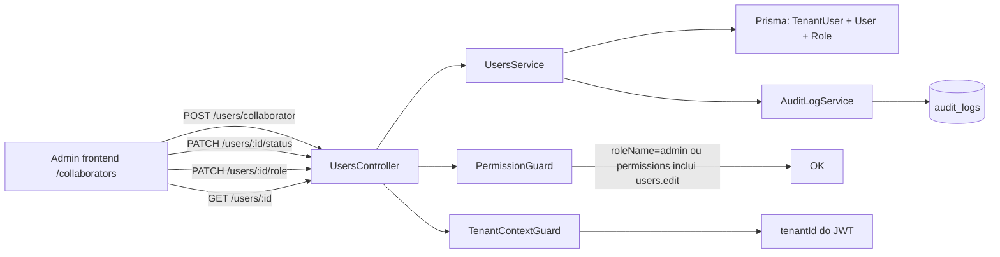

# Plano — Criação de Usuários + Estrutura de Permissões (escopo: admin endpoint + auditoria + status)

## Contexto

O **Quadro do Mané** já possui a base de permissões montada:

- Modelos Prisma: [`User`](apps/api/prisma/schema.prisma:10), [`TenantUser`](apps/api/prisma/schema.prisma:89), [`Role`](apps/api/prisma/schema.prisma:146), [`Permission`](apps/api/prisma/schema.prisma:161), [`RolePermission`](apps/api/prisma/schema.prisma:172), [`AuditLog`](apps/api/prisma/schema.prisma:551), [`LoginAttempt`](apps/api/prisma/schema.prisma:708)
- Decorator [`RequirePermissions`](apps/api/src/common/decorators/require-permissions.decorator.ts:4)
- Guard [`PermissionGuard`](apps/api/src/common/guards/permission.guard.ts:7) (com bypass para `roleName === 'admin'`)
- Guard [`TenantContextGuard`](apps/api/src/common/guards/tenant-context.guard.ts:5)
- Módulo [`UsersService`](apps/api/src/modules/users/users.service.ts:7) com `findAll`, `createCollaborator`, `updateCollaborator`, `updateProfile`
- Módulo [`RolesService`](apps/api/src/modules/roles/roles.service.ts:4) com CRUD básico
- Módulo [`AuditLogService`](apps/api/src/modules/audit-log/audit-log.service.ts:4) pronto para registrar eventos
- Frontend [`permissions.ts`](apps/web/src/lib/permissions.ts:1) com `can`, `canAny`, `usePermission`
- Página [`/collaborators`](apps/web/src/app/(app)/collaborators/page.tsx:9) que lista usuários, mas **não expõe status, troca de role nem auditoria**

Esta entrega endurece o que existe, sem convite por e-mail nem edição granular de permissões pelo frontend (ficam para iterações futuras).

## Diagrama do fluxo

## Mudanças no schema Prisma

Adicionar em [`schema.prisma`](apps/api/prisma/schema.prisma):

- `TenantUser.status` (enum `TenantUserStatus`: `ACTIVE`, `INVITED`, `SUSPENDED`) — diferenciando desativado de nunca-convidado
- `TenantUser.mustChangePassword` (`Boolean`, default `false`) — flag para primeiro acesso
- `TenantUser.lastInviteAt` (`DateTime?`) — carimbo do último convite
- `TenantUser.disabledAt` (`DateTime?`)
- `TenantUser.disabledReason` (`String?`)

Gerar migration: `npx prisma migrate dev --name tenant_user_status_fields`.

## Backend

### [`UsersService`](apps/api/src/modules/users/users.service.ts)

Refatorar em métodos menores, todos recebendo `tenantId` e registrando auditoria:

- `findAll(tenantId)` — manter, adicionar filtro opcional `?status=`
- `findOne(tenantId, tenantUserId)` — detalhes completos
- `createCollaborator(tenantId, dto, actor)` — cria User+TenantUser; emite `audit.user.create`
- `updateCollaborator(tenantId, tenantUserId, dto, actor)` — emite `audit.user.update`
- `setStatus(tenantId, tenantUserId, status, reason, actor)` — emite `audit.user.status_change`
- `assignRole(tenantId, tenantUserId, roleId, actor)` — emite `audit.user.role_change`
- `getEffectivePermissions(tenantId, tenantUserId)` — retorna códigos de Permission da role atual

### [`UsersController`](apps/api/src/modules/users/users.controller.ts)

Manter guards e adicionar:

- `GET /users/:id` — `@RequirePermissions('users.view')`
- `PATCH /users/:id/status` — `@RequirePermissions('users.disable')`
- `PATCH /users/:id/role` — `@RequirePermissions('users.edit')`
- `GET /users/:id/permissions` — `@RequirePermissions('users.view')`

### DTOs com `class-validator`

Criar [`apps/api/src/modules/users/dto/`](apps/api/src/modules/users/):

- `create-user.dto.ts` (name, email, phone opcional, password opcional, roleId opcional)
- `update-user.dto.ts` (campos parciais)
- `set-status.dto.ts` (status enum, reason opcional)
- `assign-role.dto.ts` (roleId uuid)

### [`PermissionGuard`](apps/api/src/common/guards/permission.guard.ts)

- Manter bypass de admin
- Garantir que `user.permissions` esteja populado pelo `JwtStrategy` (já é)
- Quando o guard dispara, registrar log com `required` vs `present` para debug (opcional)

### Auth — inatividade

No [`AuthService`](apps/api/src/modules/auth/auth.service.ts), ao carregar `/auth/me`:

- Verificar `tenantUser.isActive === true`
- Bloquear JWT com `ForbiddenException('Usuário desativado')` se inativo
- Revogar refresh tokens ativos do vínculo

## Frontend

### [`apps/web/src/lib/auth.ts`](apps/web/src/lib/auth.ts)

- Tipar `useAuthStore` para incluir `permissions: string[]` e `roleName: string`

### [`apps/web/src/app/(app)/collaborators/page.tsx`](apps/web/src/app/(app)/collaborators/page.tsx)

- Exibir badge `Ativo` / `Suspenso` ao lado do nome
- Botões condicionais via `usePermission`:
  - `users.edit` → abrir modal de edição (reutilizar)
  - `users.disable` → toggle ativar/desativar
- Novo modal de troca de role (`PATCH /users/:id/role`)
- Refresh do `['users']` após mutações

### [`apps/web/src/app/(app)/audit/page.tsx`](apps/web/src/app/(app)/audit/page.tsx) (novo)

- Listar logs paginados de `GET /audit-log`
- Filtros: actor, action, intervalo de datas

### Sidebar

- Adicionar item "Auditoria" sob Settings, visível apenas se `can('audit.view')`

## Tarefas (ordem de execução)

1. Persistir este plano ✅
2. Atualizar [`schema.prisma`](apps/api/prisma/schema.prisma) com `TenantUser.status`, `mustChangePassword`, `lastInviteAt`, `disabledAt`, `disabledReason` e enum
3. Rodar `npx prisma migrate dev --name tenant_user_status_fields`
4. Criar DTOs em [`apps/api/src/modules/users/dto/`](apps/api/src/modules/users/)
5. Refatorar [`UsersService`](apps/api/src/modules/users/users.service.ts) com métodos granulares
6. Adicionar endpoints admin em [`UsersController`](apps/api/src/modules/users/users.controller.ts)
7. Injetar `AuditLogService` e registrar ações sensíveis
8. Bloquear usuário inativo em [`AuthService`](apps/api/src/modules/auth/auth.service.ts) no `/auth/me` e login
9. Tipar `useAuthStore` em [`apps/web/src/lib/auth.ts`](apps/web/src/lib/auth.ts)
10. Evoluir [`/collaborators`](apps/web/src/app/(app)/collaborators/page.tsx) com status, toggle e troca de role
11. Criar [`/audit`](apps/web/src/app/(app)/audit/page.tsx)
12. Atualizar [`sidebar`](apps/web/src/components/layout/sidebar.tsx) com item Auditoria
13. Validar manualmente o fluxo: criar → listar → editar → desativar → reativar → trocar role → conferir log

## Não-objetivos (próxima iteração)

- Convite por e-mail com token
- Redefinição / primeiro acesso via link mágico
- Editor granular de permissões por role no frontend
- Bloqueio automático por tentativas de login (já existe `LoginAttempt` no schema — usar depois)
