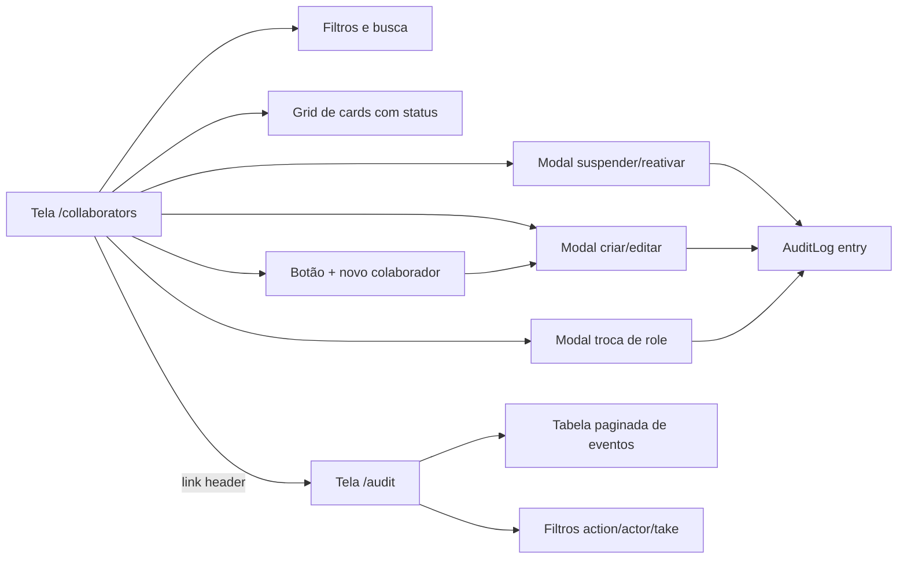

# Plano — UI de Usuários e Auditoria

## Contexto

Backend já entrega todos os endpoints administrativos (criar, listar, editar, desativar/ativar, trocar role, permissões efetivas) e a auditoria grava `actor`, IP, user-agent e metadata. Falta a **interface** que permita ao admin do tenant operar tudo isso sem `curl`.

## Páginas/rotas envolvidas

- [`/collaborators`](apps/web/src/app/(app)/collaborators/page.tsx:9) — reescrita como console administrativo.
- [`/audit`](apps/web/src/app/(app)/audit/page.tsx) — nova página de auditoria.
- [`sidebar.tsx`](apps/web/src/components/layout/sidebar.tsx) — novo item "Auditoria" sob "Configurações".
- [`lib/permissions.ts`](apps/web/src/lib/permissions.ts:1) — `can`, `canAny`, `usePermission` já existem.

## Diagrama de telas



## Tela /collaborators

### Header
- Título "Colaboradores" + subtítulo
- Busca por nome/e-mail (filtra em memória)
- Botão **+ Novo colaborador** (visível só com `can('users.create')`)
- Toggle "Mostrar inativos" (default: só ativos)

### Cards
Cada card mostra:
- Avatar (iniciais se sem foto)
- Nome + e-mail
- Badge de `status` (cores: `ACTIVE` verde, `INVITED` âmbar, `SUSPENDED` vermelho)
- Role atual (pill) + cargo/departamento
- Equipes em que é membro (chips)
- Ações (visíveis conforme permissão):
  - **Editar** → `users.edit`
  - **Trocar role** → `users.edit`
  - **Suspender/Reativar** → `users.disable`

### Modal criar/editar
- Campos: nome, e-mail, telefone, cargo, departamento, roleId, password (opcional no editar)
- Validação local + erros do backend inline
- Switch "Enviar como convite" (só no criar) — sem senha, status vira `INVITED`

### Modal trocar role
- Select com roles do tenant + opção "Sem role"
- Confirma antes de salvar (alert com nome anterior/novo)

### Modal suspender/reativar
- Lista de radios: `ACTIVE` / `INVITED` / `SUSPENDED`
- Textarea "Motivo" (opcional)
- Confirma antes de aplicar

## Tela /audit

- Tabela com colunas: `quando`, `ator`, `ação`, `alvo`, `metadata`
- Cores por prefixo de ação (`user.*` azul, `auth.*` roxo, etc.)
- Filtros no topo: `action` (texto), `actorUserId` (dropdown), `take` (slider 50/100/200/500)
- Paginação simples (limit/offset)
- Botão "Atualizar"

## Helpers

### Types [`apps/web/src/types/user.ts`](apps/web/src/types/user.ts)
```ts
export type TenantUserStatus = 'ACTIVE' | 'INVITED' | 'SUSPENDED';

export interface TenantUserCard {
  id: string;           // tenantUserId
  userId: string;
  roleId: string | null;
  jobTitle?: string | null;
  department?: string | null;
  isActive: boolean;
  status: TenantUserStatus;
  mustChangePassword: boolean;
  disabledReason?: string | null;
  disabledAt?: string | null;
  user: { id; name; email; avatarUrl?; phone?; isActive; lastLoginAt?; };
  role?: { id; name; isSystemRole? } | null;
  teamMemberships?: { team: { id; name; color? } }[];
}

export interface AuditLogEntry {
  id: string;
  action: string;
  targetType?: string | null;
  targetId?: string | null;
  ipAddress?: string | null;
  userAgent?: string | null;
  metadataJson?: string | null;
  createdAt: string;
  actor?: { id; name; email } | null;
}
```

### Permissões (já existem em [`lib/permissions.ts`](apps/web/src/lib/permissions.ts))
- `usePermission('users.create' | 'users.edit' | 'users.disable' | 'audit.view')`
- `canAny('users.edit', 'users.disable')` — para habilitar área de ações se qualquer uma servir

## Mudanças em arquivos

| Arquivo | Mudança |
|---|---|
| [`apps/web/src/lib/auth.ts`](apps/web/src/lib/auth.ts) | Já tem `permissions`/`role` — sem mudança |
| [`apps/web/src/types/user.ts`](apps/web/src/types/user.ts) | **NOVO** — tipos `TenantUserStatus`, `TenantUserCard`, `AuditLogEntry` |
| [`apps/web/src/app/(app)/collaborators/page.tsx`](apps/web/src/app/(app)/collaborators/page.tsx:9) | **REESCRITA** completa |
| [`apps/web/src/app/(app)/audit/page.tsx`](apps/web/src/app/(app)/audit/page.tsx) | **NOVO** |
| [`apps/web/src/components/layout/sidebar.tsx`](apps/web/src/components/layout/sidebar.tsx:20) | Adicionar item Auditoria condicional |
| [`apps/web/src/lib/api.ts`](apps/web/src/lib/api.ts) | Verificar se `api.patch/post` aceitam o path com `:id` (já aceitam) |

## Componentes auxiliares a criar (na própria página para manter escopo curto)
- `StatusBadge` (cor por status)
- `RolePill` (cor por role)
- `UserAvatar` (iniciais com cor determinística)
- `ConfirmDialog` (modal genérico de confirmação)

## Fluxos end-to-end

1. **Criar** → abrir modal → submit → `POST /users` → refresh da query → toast de sucesso.
2. **Editar** → modal pré-preenchido → `PATCH /users/:id` → refresh.
3. **Trocar role** → modal dedicado → `PATCH /users/:id/role` → refresh.
4. **Suspender** → modal com motivo → `PATCH /users/:id/status` → refresh + toast.
5. **Reativar** → confirmar ação → `PATCH /users/:id/status {ACTIVE}` → refresh.
6. **Auditoria** → listar eventos → filtrar por action/ator → ver metadata como JSON pretty.

## Validação manual no navegador
- Login admin → /collaborators → criar "João Teste" (gestor) → ver card verde
- Trocar role dele para colaborador → ver card sem role pill amarela
- Suspender com motivo "teste" → ver badge vermelho
- Reativar → ver badge verde
- Abrir /audit → ver 5 eventos (create, role_change, suspend, activate + o próprio login)
- Logout → logar como outro user sem `users.edit` → botões sensíveis escondidos

## Não-objetivos
- Edição inline de campos do card
- Drag & drop para mudar role
- Exportação CSV da auditoria
- Filtros por intervalo de datas (fica para próxima iteração)
